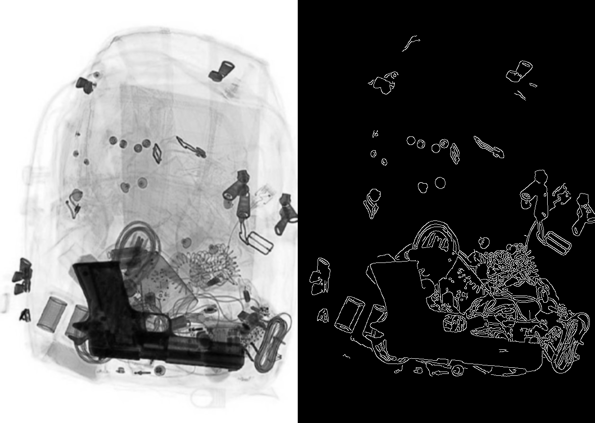
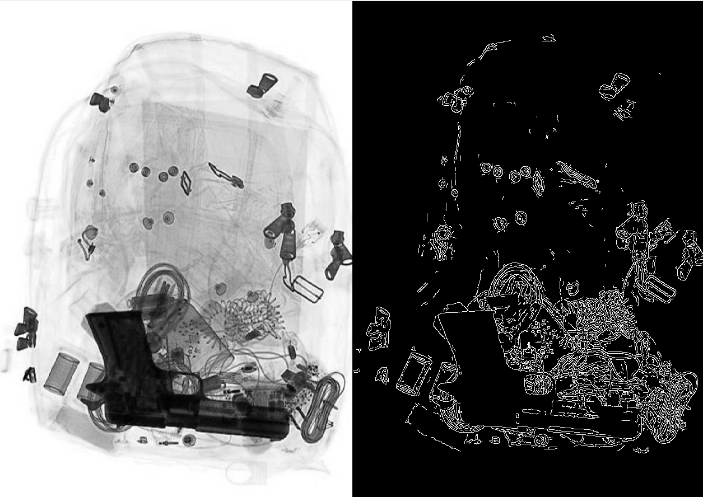
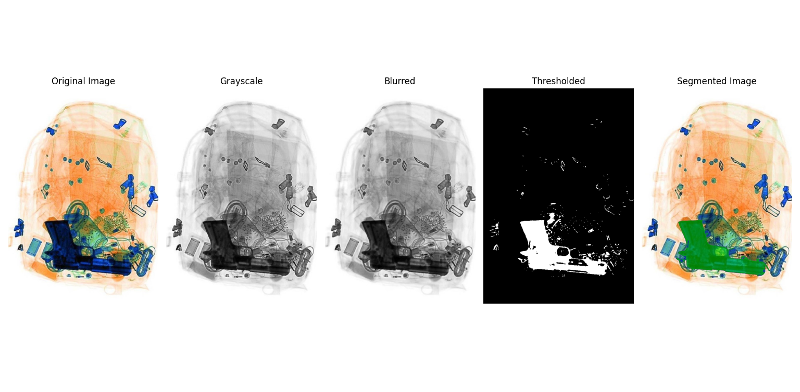

### tool.py:

OpenCV (cv2) for image processing and analysis.
NumPy (np) for numerical calculations.

 - Canny represents an application that performs edge detection and
   contour finding visually.

- The user is provided with sliders to set upper and lower edge thresholds for edge detection on the image.

- Visual results are presented to the user by visualising the contours found as a result of the edge detection process.

- The user can end the programme by pressing the ‘ESC’ key. When the programme ends, all windows are closed.

- You can use this tool to decide your treshold values and use them in the segmentation part.

### segmentation.py:

NumPy (np) was used for numerical calculations and working with arrays.
OpenCV (cv2) for image processing and analysis.
Matplotlib (plt) for image visualisation and plotting.

- It performs object detection and segmentation on the image.

- The image is converted to greyscale, blur is applied, thresholded and contours are determined.

- The contours are drawn on a mask and added to the original image to present the segmentation visually.

### Results
The difference between blurred and unblurred images.

Final result image:

